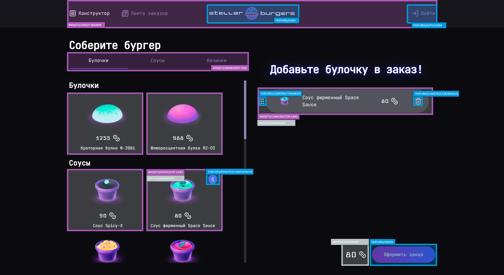

# Проект: Stellar Burgers

## Описание
«Stellar Burgers» — это веб-приложение космической бургерной с адаптивным дизайном, выпускной проект курса **«React-разработчик»** от Яндекс Практикума. Приложение включает в себя большое количество функций, несколько ключевых пользовательских сценариев и сложную логику.

## Просмотр


Запустить можно так:

```
git clone https://github.com/gyolkin/stellar-burgers.git
cd react-burger
npm i
npm run dev
```
Приложение запустится. В консоли появится ссылка, чтобы его открыть.

## Технологический стек
- React 18
- Redux Toolkit (& RTK Query)
- React Router DOM v6.3.0
- React DND
- TailwindCSS

